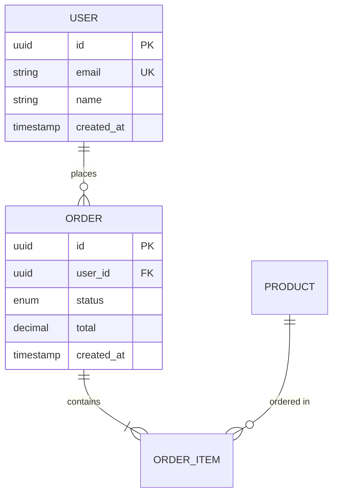
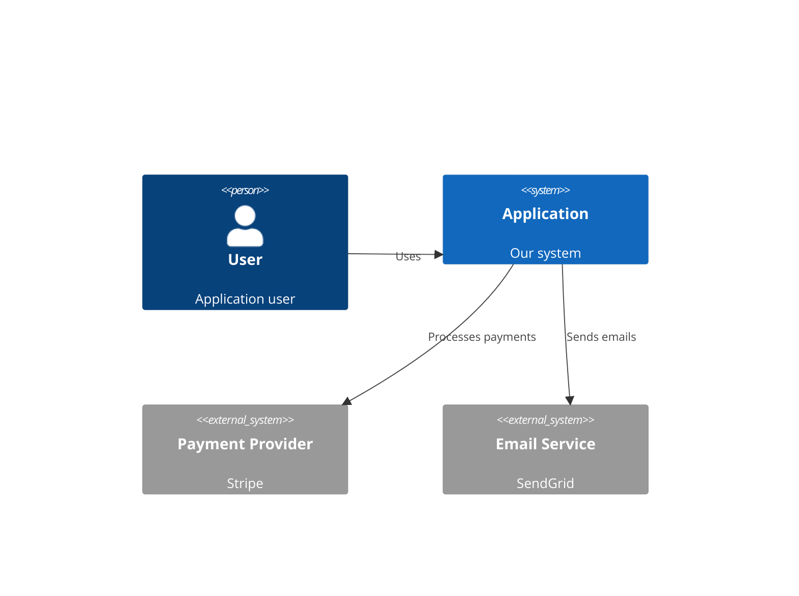

# Architecture Design Skill

> Technical system architecture with modern best practices

---

## Skill Metadata

```yaml
name: architecture-design
version: 1.0.0
description: Technical architecture design with stack selection, data modeling, and API design
triggers:
  - /architecture-design
  - /tech-architecture
  - /system-design
dependencies:
  - skill: product-research (for tech stack insights)
  - skill: uiux-design (for component requirements)
  - mcp: context7 (for library documentation)
  - mcp: augment-context-engine (for codebase analysis)
```

---

## Core Principles

### 1. Pragmatic Architecture
- **Solve real problems** - Not theoretical elegance
- **Start simple** - Complexity only when proven necessary
- **Evolution over revolution** - Design for incremental improvement
- **Boring technology** - Proven solutions over shiny new tools

### 2. Evidence-Based Decisions
- **Document trade-offs** - Every choice has costs
- **Reference prior art** - Learn from similar systems
- **Validate assumptions** - POC before commitment
- **Measure outcomes** - Define success metrics

### 3. Implementation-Ready Design
- **Actionable specifications** - Not hand-wavy diagrams
- **Clear interfaces** - Contracts between components
- **Testable boundaries** - Design for verification
- **Deployment-aware** - Consider operational reality

---

## Tech Stack Selection Framework

### Decision Criteria Matrix

For each technology choice, evaluate:

```markdown
| Criterion | Weight | Description |
|-----------|--------|-------------|
| Team Expertise | 25% | Current team familiarity |
| Ecosystem Maturity | 20% | Libraries, tools, community |
| Performance Fit | 20% | Meets technical requirements |
| Hiring Pool | 15% | Talent availability |
| Long-term Viability | 10% | Company backing, roadmap |
| Integration Ease | 10% | Works with other choices |
```

### Stack Documentation Template

```markdown
## Technology: [Name]

### Selection Rationale
| Factor | Assessment | Evidence |
|--------|------------|----------|
| Team Experience | High/Medium/Low | "3 of 4 devs have production experience" |
| Community Size | Large/Medium/Small | "150k GitHub stars, 10k Discord members" |
| Performance | Excellent/Good/Adequate | "Benchmarks show 10k RPS for our use case" |

### Alternatives Considered
| Alternative | Pros | Cons | Why Not Selected |
|-------------|------|------|------------------|
| [Alt 1] | - Pro 1<br>- Pro 2 | - Con 1<br>- Con 2 | Primary reason |
| [Alt 2] | - Pro 1<br>- Pro 2 | - Con 1<br>- Con 2 | Primary reason |

### Risks & Mitigations
| Risk | Probability | Impact | Mitigation |
|------|-------------|--------|------------|
| [Risk 1] | Low/Med/High | Low/Med/High | [Strategy] |

### Version & Configuration
- Version: X.Y.Z (pinned)
- Key Configuration: [Settings]
- Update Strategy: [Approach]
```

---

## Architecture Pattern Library

### Frontend Architectures

#### 1. Component-Based SPA (React/Vue/Svelte)
```
Use When:
├── Rich interactivity required
├── Complex client-side state
├── Offline capabilities needed
└── Single deployment target

Structure:
src/
├── components/      # Reusable UI components
│   ├── common/      # Buttons, inputs, cards
│   └── features/    # Feature-specific components
├── hooks/           # Custom React hooks
├── stores/          # State management
├── services/        # API clients
├── utils/           # Helper functions
└── pages/           # Route components
```

#### 2. Server-Rendered with Islands (Next.js/Nuxt/SvelteKit)
```
Use When:
├── SEO critical
├── Fast initial load required
├── Content-heavy application
└── Progressive enhancement needed

Structure:
app/
├── (routes)/        # File-based routing
├── components/      # Shared components
├── lib/             # Server utilities
└── api/             # API routes
```

#### 3. Multi-Page Application (HTMX/Hotwire)
```
Use When:
├── Simple interactions
├── Maximum SEO control
├── Team prefers server-side
└── Minimal JavaScript desired

Structure:
templates/
├── layouts/         # Base templates
├── pages/           # Full page templates
└── partials/        # Reusable fragments
```

### Backend Architectures

#### 1. Modular Monolith
```
Use When:
├── Small team (1-5 devs)
├── Uncertain domain boundaries
├── Rapid iteration phase
└── Simple deployment preferred

Structure:
src/
├── modules/
│   ├── users/
│   │   ├── domain/      # Business logic
│   │   ├── application/ # Use cases
│   │   ├── infrastructure/ # DB, external
│   │   └── api/         # HTTP handlers
│   ├── billing/
│   └── notifications/
├── shared/              # Cross-cutting concerns
└── infrastructure/      # Framework setup
```

#### 2. Microservices
```
Use When:
├── Large team (10+ devs)
├── Clear domain boundaries
├── Independent scaling needs
└── Polyglot requirements

Structure:
services/
├── user-service/
├── billing-service/
├── notification-service/
└── api-gateway/
```

#### 3. Serverless Functions
```
Use When:
├── Variable/spiky traffic
├── Cost optimization priority
├── Simple, stateless operations
└── Event-driven architecture

Structure:
functions/
├── http/
│   ├── users/
│   └── webhooks/
├── scheduled/
│   └── cleanup/
└── events/
    └── processors/
```

---

## Data Modeling

### Database Selection Guide

| Use Case | Recommended | Alternatives |
|----------|-------------|--------------|
| General CRUD | PostgreSQL | MySQL, SQLite |
| Document Store | MongoDB | Firestore, CouchDB |
| Key-Value Cache | Redis | Memcached, KeyDB |
| Search | Elasticsearch | Meilisearch, Typesense |
| Time Series | TimescaleDB | InfluxDB, QuestDB |
| Graph | Neo4j | ArangoDB, DGraph |
| Vector/AI | pgvector | Pinecone, Weaviate |

### Entity-Relationship Diagram Template

```markdown
## Data Model: [Domain Name]

### Entity: [Entity Name]

| Field | Type | Constraints | Description |
|-------|------|-------------|-------------|
| id | UUID | PK, NOT NULL | Unique identifier |
| created_at | TIMESTAMP | NOT NULL, DEFAULT NOW() | Creation time |
| updated_at | TIMESTAMP | NOT NULL | Last modification |
| [field] | [type] | [constraints] | [description] |

### Relationships



### Indexes

| Table | Index Name | Columns | Type | Rationale |
|-------|------------|---------|------|-----------|
| users | idx_users_email | email | UNIQUE | Login lookup |
| orders | idx_orders_user_created | user_id, created_at | BTREE | User order history |

### Migrations Strategy

| Phase | Changes | Rollback Plan |
|-------|---------|---------------|
| 1 | Add new columns | Drop columns |
| 2 | Backfill data | Revert to snapshot |
| 3 | Remove old columns | Re-add columns |
```

---

## API Design

### RESTful API Guidelines

#### Resource Naming
```
GOOD:
/users                    # Collection
/users/{id}               # Individual resource
/users/{id}/orders        # Nested collection
/orders/{id}/items        # Nested resources

BAD:
/getUsers                 # Verb in URL
/user/{id}                # Inconsistent plurality
/users/{id}/getOrders     # Verb in nested route
```

#### HTTP Methods
```
GET    /resources         # List (with pagination)
GET    /resources/{id}    # Read single
POST   /resources         # Create
PUT    /resources/{id}    # Full update (idempotent)
PATCH  /resources/{id}    # Partial update
DELETE /resources/{id}    # Delete
```

#### Response Format
```json
{
  "data": {
    "id": "uuid",
    "type": "user",
    "attributes": {
      "email": "user@example.com",
      "name": "John Doe"
    },
    "relationships": {
      "orders": {
        "links": {
          "related": "/users/{id}/orders"
        }
      }
    }
  },
  "meta": {
    "requestId": "uuid"
  }
}
```

#### Error Response Format
```json
{
  "error": {
    "code": "VALIDATION_ERROR",
    "message": "Invalid input data",
    "details": [
      {
        "field": "email",
        "message": "Must be a valid email address"
      }
    ]
  },
  "meta": {
    "requestId": "uuid",
    "timestamp": "2024-01-01T00:00:00Z"
  }
}
```

### API Specification Template

```markdown
## Endpoint: [Method] [Path]

### Description
[What this endpoint does]

### Authentication
- Required: Yes/No
- Method: Bearer token / API key / Session

### Request

#### Path Parameters
| Parameter | Type | Required | Description |
|-----------|------|----------|-------------|
| id | UUID | Yes | Resource identifier |

#### Query Parameters
| Parameter | Type | Required | Default | Description |
|-----------|------|----------|---------|-------------|
| page | integer | No | 1 | Page number |
| limit | integer | No | 20 | Items per page |

#### Request Body
```json
{
  "email": "string (required, email format)",
  "name": "string (required, 2-100 chars)"
}
```

### Response

#### Success (200/201)
```json
{
  "data": {
    "id": "uuid",
    "email": "user@example.com",
    "name": "John Doe"
  }
}
```

#### Errors
| Status | Code | Description |
|--------|------|-------------|
| 400 | VALIDATION_ERROR | Invalid input |
| 401 | UNAUTHORIZED | Missing/invalid token |
| 404 | NOT_FOUND | Resource doesn't exist |
| 409 | CONFLICT | Duplicate email |

### Example

```bash
curl -X POST https://api.example.com/users \
  -H "Authorization: Bearer token" \
  -H "Content-Type: application/json" \
  -d '{"email": "user@example.com", "name": "John"}'
```
```

---

## Security Architecture

### Authentication Patterns

| Pattern | Use Case | Implementation |
|---------|----------|----------------|
| Session-based | Traditional web apps | Secure cookies + Redis |
| JWT | SPAs, mobile apps | Short-lived access + refresh tokens |
| API Keys | Service-to-service | Hashed keys in DB |
| OAuth 2.0 | Third-party auth | Authorization code flow |
| Passkeys/WebAuthn | Passwordless | FIDO2 authenticators |

### Security Checklist

```markdown
## Authentication & Authorization
- [ ] Password hashing (Argon2id / bcrypt)
- [ ] Rate limiting on auth endpoints
- [ ] Account lockout after failed attempts
- [ ] Secure session management
- [ ] RBAC/ABAC implemented
- [ ] JWT expiration < 15 minutes
- [ ] Refresh token rotation

## Data Protection
- [ ] Encryption at rest (AES-256)
- [ ] Encryption in transit (TLS 1.3)
- [ ] PII handling documented
- [ ] Data retention policies
- [ ] Backup encryption

## API Security
- [ ] Input validation on all endpoints
- [ ] Output encoding
- [ ] CORS configured properly
- [ ] Rate limiting implemented
- [ ] Request size limits
- [ ] SQL injection prevention (parameterized queries)
- [ ] XSS prevention (CSP, sanitization)

## Infrastructure
- [ ] Secrets in environment/vault
- [ ] No secrets in code/logs
- [ ] Dependency scanning (Snyk/Dependabot)
- [ ] Container security scanning
- [ ] Network segmentation
```

---

## Performance Architecture

### Performance Budget

| Metric | Target | Measurement |
|--------|--------|-------------|
| LCP | < 2.5s | Core Web Vitals |
| FID | < 100ms | Core Web Vitals |
| CLS | < 0.1 | Core Web Vitals |
| TTI | < 3.5s | Lighthouse |
| Bundle Size | < 200KB gzipped | Build analysis |
| API P95 | < 200ms | APM |
| API P99 | < 500ms | APM |

### Caching Strategy

```markdown
| Layer | Technology | TTL | Invalidation |
|-------|------------|-----|--------------|
| Browser | Cache-Control headers | Varies | Versioned URLs |
| CDN | Cloudflare/Fastly | 1 hour | Purge API |
| Application | Redis | 5 min | Cache-aside |
| Database | Query cache | 1 min | Write-through |
```

### Scaling Considerations

```markdown
## Horizontal Scaling Points
- [ ] Stateless application servers
- [ ] Database read replicas
- [ ] Caching layer
- [ ] Message queue for async work
- [ ] CDN for static assets

## Vertical Scaling Points
- [ ] Database instance size
- [ ] Cache memory allocation
- [ ] Worker process count

## Auto-scaling Triggers
| Metric | Scale Up | Scale Down |
|--------|----------|------------|
| CPU | > 70% for 5m | < 30% for 15m |
| Memory | > 80% | < 40% |
| Queue Depth | > 1000 | < 100 |
```

---

## Output Requirements

### Deliverable: Architecture Document

```markdown
# Technical Architecture: [Product Name]

## Executive Summary
[High-level architecture overview]

## System Context


## Technology Stack

### Frontend
[Stack selection with rationale]

### Backend
[Stack selection with rationale]

### Data Layer
[Database choices with rationale]

### Infrastructure
[Cloud services and deployment]

## Data Model
[ERD and schema definitions]

## API Specification
[Endpoint documentation]

## Security Architecture
[Authentication, authorization, data protection]

## Performance Architecture
[Budgets, caching, scaling]

## Decision Records

### ADR-001: [Decision Title]
- Status: Accepted
- Context: [Why we need this decision]
- Decision: [What we decided]
- Consequences: [Trade-offs accepted]

## Appendix
- Deployment diagrams
- Network topology
- Disaster recovery plan
```

---

## Quality Gates

### Architecture Review Checklist

- [ ] All technology choices have documented rationale
- [ ] Alternatives were considered and documented
- [ ] Data model is normalized appropriately
- [ ] API follows consistent conventions
- [ ] Security requirements addressed
- [ ] Performance budgets defined
- [ ] Scaling strategy documented
- [ ] Deployment architecture specified

### Quality Score Rubric

| Criterion | Weight | 90+ | 70-89 | Below 70 |
|-----------|--------|-----|-------|----------|
| Tech Justification | 25% | All justified | Most justified | Missing rationale |
| Completeness | 25% | All areas covered | Minor gaps | Major gaps |
| Implementability | 20% | Clear specs | Mostly clear | Ambiguous |
| Security | 15% | Comprehensive | Basic coverage | Gaps |
| Performance | 15% | Budgets defined | Partial budgets | Missing |

---

## Integration Points

### Receives From:
- `product-research` skill (competitor tech insights)
- `uiux-design` skill (component requirements)

### Feeds Into:
- `project-planning` skill (task dependencies)
- `dev-documentation` skill (implementation guide)

---

## Version History

| Version | Date | Changes |
|---------|------|---------|
| 1.0.0 | 2024-12-28 | Initial release |
