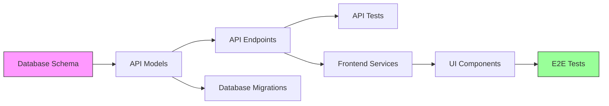
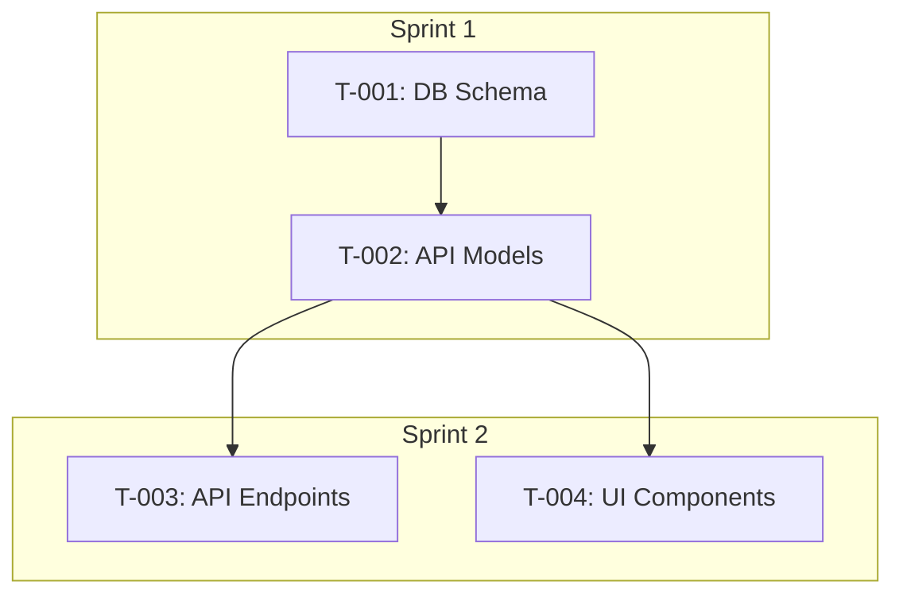

# Project Planning Skill

> Task decomposition with dependencies, milestones, and risk assessment

---

## Skill Metadata

```yaml
name: project-planning
version: 1.0.0
description: Project planning with task breakdown, dependencies, milestones, and risk management
triggers:
  - /project-planning
  - /task-breakdown
  - /project-plan
dependencies:
  - skill: product-research (for feature priorities)
  - skill: uiux-design (for component scope)
  - skill: architecture-design (for technical dependencies)
```

---

## Core Principles

### 1. Atomic Task Definition
- **Single responsibility** - One clear outcome per task
- **Verifiable completion** - Binary done/not-done
- **Independent execution** - Minimal external blocks
- **Time-bounded** - Maximum 16 hours per task

### 2. Dependency Transparency
- **Explicit relationships** - No hidden dependencies
- **Critical path visibility** - Identify bottlenecks
- **Parallel opportunities** - Maximize concurrent work
- **Risk buffering** - Account for uncertainty

### 3. Stakeholder Alignment
- **Clear priorities** - P0-P3 classification
- **Milestone markers** - Visible progress points
- **Scope boundaries** - What's in/out explicitly
- **Flexibility built-in** - Room for learning

---

## Task Decomposition Framework

### Granularity Guidelines

```markdown
| Level | Scope | Duration | Example |
|-------|-------|----------|---------|
| Epic | Feature area | Weeks-Months | "User Authentication System" |
| Story | User-facing capability | Days-Week | "User can login with email" |
| Task | Developer work unit | 2-16 hours | "Implement login API endpoint" |
| Subtask | Atomic action | 1-4 hours | "Add password validation" |
```

### Task Size Limits

```
MANDATORY CONSTRAINTS:

Maximum task duration: 16 hours
├── If larger → Split into subtasks
├── If uncertain → Add spike/research task first
└── If blocked → Create dependency task

Minimum task duration: 2 hours
├── If smaller → Combine with related work
└── Exception: Documentation, config changes
```

### Task Description Template

```markdown
## Task: [Clear Action Verb] + [Object] + [Context]

### Description
[2-3 sentences explaining what needs to be done and why]

### Acceptance Criteria
- [ ] [Specific, measurable criterion 1]
- [ ] [Specific, measurable criterion 2]
- [ ] [Specific, measurable criterion 3]

### Technical Notes
- [Implementation hint or constraint]
- [Related code locations]

### Dependencies
- Blocked by: [Task IDs that must complete first]
- Blocks: [Task IDs that wait for this]

### Estimate
- Optimistic: [X hours]
- Expected: [Y hours]
- Pessimistic: [Z hours]

### Priority
- Level: P0/P1/P2/P3
- Rationale: [Why this priority]
```

---

## Priority Framework

### Priority Levels

```markdown
## P0 - Critical (Must Have)
Definition: Product cannot launch without this
Criteria:
├── Core value proposition
├── Legal/compliance requirements
├── Security fundamentals
└── Data integrity essentials

## P1 - High (Should Have)
Definition: Significant impact on launch quality
Criteria:
├── Major user flows
├── Key differentiating features
├── Performance requirements
└── Important integrations

## P2 - Medium (Could Have)
Definition: Improves product but not essential
Criteria:
├── Enhanced user experience
├── Secondary features
├── Optimization opportunities
└── Nice-to-have integrations

## P3 - Low (Won't Have This Time)
Definition: Backlog for future iterations
Criteria:
├── Edge case handling
├── Advanced features
├── Polish and refinement
└── Experimental ideas
```

### Priority Matrix

```markdown
| Priority | % of Scope | Deadline Flexibility | Example |
|----------|------------|----------------------|---------|
| P0 | ~40% | None - must complete | Login, Core CRUD |
| P1 | ~30% | Low - strongly prefer | Dashboard, Reports |
| P2 | ~20% | Medium - if time permits | Dark mode, Exports |
| P3 | ~10% | High - post-launch backlog | AI features, Automation |
```

---

## Dependency Mapping

### Dependency Types

```markdown
## Finish-to-Start (FS) - Most Common
Task B cannot start until Task A finishes
Example: "Implement API" → "Write API tests"

## Start-to-Start (SS)
Task B cannot start until Task A starts
Example: "Start design system" → "Start component library"

## Finish-to-Finish (FF)
Task B cannot finish until Task A finishes
Example: "Write code" → "Write documentation"

## Start-to-Finish (SF) - Rare
Task B cannot finish until Task A starts
Example: "New system live" → "Old system decommission"
```

### Dependency Documentation

```markdown
## Dependency Graph



## Critical Path
A → B → C → F → G → H (28 hours)

## Parallel Opportunities
| Track 1 | Track 2 | Track 3 |
|---------|---------|---------|
| API Development | Frontend Components | Documentation |
| C → E | G → H | Ongoing |
```

---

## Milestone Planning

### Milestone Definition

```markdown
## Milestone: [Name]

### Objective
[What this milestone achieves]

### Success Criteria
- [ ] [Measurable outcome 1]
- [ ] [Measurable outcome 2]
- [ ] [Measurable outcome 3]

### Included Tasks
| Task ID | Task Name | Priority | Status |
|---------|-----------|----------|--------|
| T-001 | [Name] | P0 | Pending |
| T-002 | [Name] | P0 | Pending |

### Dependencies
- Requires: [Previous milestone if any]
- Enables: [Next milestone]

### Demo/Deliverable
[What can be shown/delivered at this point]

### Risk Assessment
| Risk | Probability | Impact | Mitigation |
|------|-------------|--------|------------|
| [Risk 1] | Low/Med/High | Low/Med/High | [Action] |
```

### Standard Milestone Structure

```markdown
## Typical Project Milestones

### M0: Project Kickoff (Week 0)
- [ ] Requirements confirmed
- [ ] Team allocated
- [ ] Dev environment setup
- [ ] Architecture approved

### M1: Foundation Complete (Week 2-3)
- [ ] Database schema implemented
- [ ] API skeleton deployed
- [ ] CI/CD pipeline working
- [ ] Component library started

### M2: Core Features (Week 4-6)
- [ ] Primary user flows complete
- [ ] Authentication working
- [ ] Core CRUD operations
- [ ] Basic testing in place

### M3: Feature Complete (Week 7-9)
- [ ] All P0/P1 features implemented
- [ ] Integration testing complete
- [ ] Performance baseline met
- [ ] Security audit passed

### M4: Launch Ready (Week 10-12)
- [ ] P2 features implemented
- [ ] Documentation complete
- [ ] Production environment ready
- [ ] Monitoring configured
```

---

## Risk Assessment

### Risk Categories

```markdown
## Technical Risks
- New technology adoption
- Integration complexity
- Performance uncertainty
- Scalability unknowns

## Resource Risks
- Team availability
- Skill gaps
- Knowledge concentration
- External dependencies

## Scope Risks
- Requirements volatility
- Feature creep
- Stakeholder misalignment
- Estimation errors

## External Risks
- Third-party service changes
- Regulatory changes
- Market shifts
- Competitive pressure
```

### Risk Register Template

```markdown
## Risk Register

| ID | Category | Description | Probability | Impact | Score | Owner | Mitigation | Contingency | Status |
|----|----------|-------------|-------------|--------|-------|-------|------------|-------------|--------|
| R-001 | Technical | New payment API unstable | Medium | High | 6 | Dev Lead | Early POC, fallback processor | Manual processing SOP | Active |
| R-002 | Resource | Key developer vacation | High | Medium | 6 | PM | Cross-training before leave | Contractor backup | Monitoring |

### Probability Scale
1 - Low (< 20% chance)
2 - Medium (20-60% chance)
3 - High (> 60% chance)

### Impact Scale
1 - Low (< 1 week delay, minor rework)
2 - Medium (1-2 week delay, significant rework)
3 - High (> 2 week delay, major scope change)

### Risk Score
Score = Probability × Impact
High Risk: 6-9 (requires active mitigation)
Medium Risk: 3-4 (monitor closely)
Low Risk: 1-2 (accept and monitor)
```

---

## Estimation Techniques

### Three-Point Estimation

```markdown
## Formula
Expected = (Optimistic + 4 × Most Likely + Pessimistic) / 6
Standard Deviation = (Pessimistic - Optimistic) / 6

## Example
| Task | Optimistic | Most Likely | Pessimistic | Expected | StdDev |
|------|------------|-------------|-------------|----------|--------|
| API Endpoint | 2h | 4h | 8h | 4.3h | 1h |
| UI Component | 4h | 8h | 16h | 8.7h | 2h |
| Integration | 8h | 16h | 32h | 17.3h | 4h |
```

### Story Points Reference

```markdown
| Points | Complexity | Reference Task |
|--------|------------|----------------|
| 1 | Trivial | Config change, copy update |
| 2 | Simple | Single component, one endpoint |
| 3 | Standard | Feature with 2-3 components |
| 5 | Complex | Multiple components, integrations |
| 8 | Very Complex | New system, multiple unknowns |
| 13 | Epic-sized | Should be broken down |
```

---

## Output Requirements

### Deliverable: Project Plan Document

```markdown
# Project Plan: [Product Name]

## Overview

### Project Summary
[Brief description of the project]

### Objectives
1. [Primary objective]
2. [Secondary objective]
3. [Tertiary objective]

### Scope
**In Scope:**
- [Feature 1]
- [Feature 2]

**Out of Scope:**
- [Excluded item 1]
- [Excluded item 2]

### Timeline Overview
| Milestone | Target Date | Key Deliverables |
|-----------|-------------|------------------|
| M0: Kickoff | Week 0 | Team aligned, env ready |
| M1: Foundation | Week 2 | Core infrastructure |
| M2: Core Features | Week 5 | Main user flows |
| M3: Feature Complete | Week 8 | All P0/P1 done |
| M4: Launch | Week 10 | Production ready |

## Task Breakdown

### Epic: [Epic Name]

#### Story: [Story Name]
| ID | Task | Priority | Estimate | Dependencies | Assignee |
|----|------|----------|----------|--------------|----------|
| T-001 | [Task] | P0 | 4h | None | TBD |
| T-002 | [Task] | P0 | 8h | T-001 | TBD |

[Repeat for all epics/stories]

## Dependency Graph



## Milestones

### M1: Foundation Complete
[Full milestone documentation]

### M2: Core Features
[Full milestone documentation]

## Risk Register

| ID | Risk | Score | Mitigation |
|----|------|-------|------------|
| R-001 | [Risk] | 6 | [Mitigation] |

## Resource Allocation

| Role | Allocation | Responsibilities |
|------|------------|------------------|
| Tech Lead | 100% | Architecture, code review |
| Frontend Dev | 100% | UI implementation |
| Backend Dev | 100% | API, database |
| QA | 50% | Testing, automation |

## Success Metrics

| Metric | Target | Measurement |
|--------|--------|-------------|
| On-time delivery | 90% tasks | Sprint completion rate |
| Code quality | < 5 bugs/sprint | Bug count |
| Performance | < 200ms P95 | APM |

## Appendix

### Full Task List
[Complete task inventory]

### Gantt Chart
[Visual timeline if applicable]

### Communication Plan
[Meeting cadence, status reporting]
```

---

## Quality Gates

### Planning Review Checklist

- [ ] All tasks have clear acceptance criteria
- [ ] No task exceeds 16 hours
- [ ] Dependencies are explicitly mapped
- [ ] Critical path is identified
- [ ] Milestones have measurable success criteria
- [ ] Risks are documented with mitigations
- [ ] Priorities are assigned and justified
- [ ] Estimates use three-point method

### Quality Score Rubric

| Criterion | Weight | 90+ | 70-89 | Below 70 |
|-----------|--------|-----|-------|----------|
| Task Clarity | 25% | All clear criteria | Most clear | Vague tasks |
| Dependency Accuracy | 25% | All mapped | Minor gaps | Major gaps |
| Estimation Quality | 20% | Three-point used | Single estimates | No estimates |
| Risk Coverage | 15% | Comprehensive | Basic | Missing |
| Milestone Definition | 15% | Clear, measurable | Mostly clear | Vague |

---

## Integration Points

### Receives From:
- `product-research` skill (feature priorities)
- `uiux-design` skill (component scope)
- `architecture-design` skill (technical dependencies)

### Feeds Into:
- `dev-documentation` skill (task list integration)

---

## Version History

| Version | Date | Changes |
|---------|------|---------|
| 1.0.0 | 2024-12-28 | Initial release |
